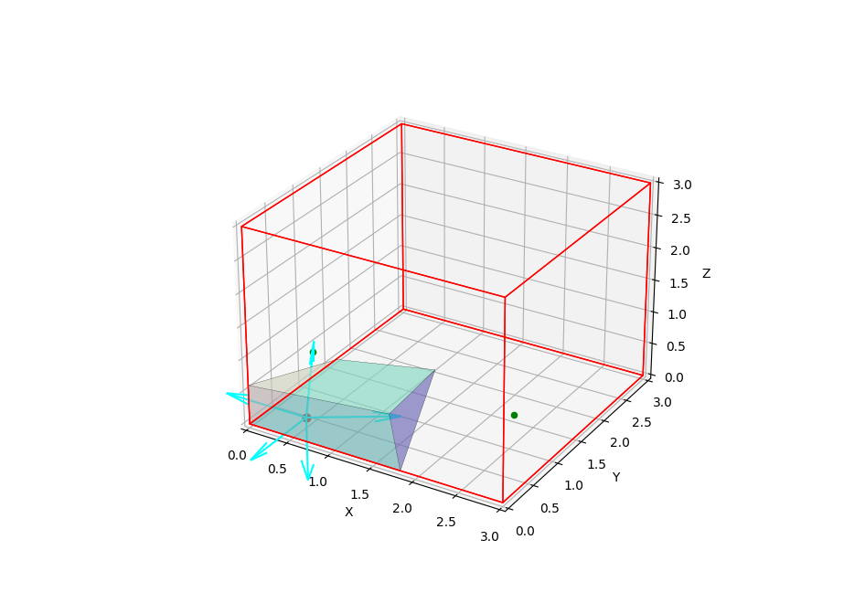

This function draw a Voronoi cell given its id and a container object from the [tess](https://github.com/wackywendell/tess) library. It can also draw cell neighbours and normals to the cell faces, as they are provided by the library.

This is an example plot:

It may have some bugs and it does not draw more than one cell at a time, correction and extra functions are more than welcome. 
